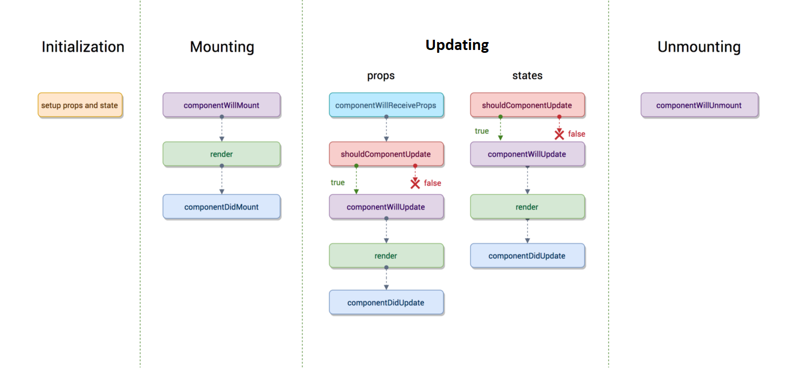

# AMCO: React Cheatsheet

## **Requisitos**

* ### [Instalar NodeJS](https://nodejs.org/es/)
* ### (Opcional) [Instalar Git Bash para usar desde VSCode](https://git-scm.com/downloads)

## **Comandos iniciales**
 

### <ins>Crear un projecto</ins>
 
    
    npx create-react-app nombre-de-la-app

### <ins>Agregar librerías</ins>
 

#### <ins>De Componentes CSS (Una sola):</ins>
* PrimeReact
        
        npm install primereact
        npm install primeicons
* Bootstrap
    
        npm install react-bootstrap bootstrap

 

#### <ins>De Routing (Single Page Application):</ins>
* React Router Dom

        npm install react-router-dom
 

#### <ins>De Testing (Por el amor de Dios, testeá):</ins>

* Jest (Debería venir instalado con react-create-app)

* Enzyme + Dependencias (Actualizado 28/12/20, revisar versión de adapter cada tanto)
        
        npm install enzyme react-test-renderer @wojtekmaj/enzyme-adapter-react-17
 

#### <ins>Consumir APIs (Una sola):</ins>
* Axios

        npm install axios
* Con ES6 podés usar Fetch que ya viene en JS, pero es menos frecuente en React

 

#### <ins>Para Estilar:</ins>
 

* __Lo más recomendado es usar CSS Modules. Probé con otras opciones como styled-components y radium, y el código termina súper acoplado y difícil de seguir por querer meter los estilos y el JS en el mismo archivo.__

 

#### <ins> (Opcional) Agregar typescript al proyecto:</ins>

 

        npm install --save typescript @types/node @types/react @types/react-dom @types/jest
Además los archivos _.js_ que create-react-app haya creado por nosotros deberán cambiarse a _.tsx_.  
Tené en cuenta que casi nadie en Desa sabe Typescript (yo tampoco).

 

## __Debuggear React Apps__
 

* Método casero: Revisar la consola en el browser cuando explota algo, y ver dónde ocurre el error.

* Debug en browser: Abrir la consola (F12). Ir a la pestaña de Depurador (Sources). Ir a la parte de código sospechosa y crear un break (punto de debug) donde queramos que la app se detenga.  
A continuación apretar el botón que produzca el evento para llegar a ese código; o refrescar la página (F5) si es algo que sucede al comienzo.  
De ahi llegamos al break y podemos avanzar paso a paso viendo las variables y el stacktrace.

* Add-on: **React Dev Tools**. Está al menos en Chrome y Firefox. Permite ver árboles de React tal como en el código y ver su estado interno, props, ver su resultado en HTML, *cambiar las variables en el momento*, etc.

 

## **Controlar Excepciones**
Por ejemplo, al realizar un request al backend y que no haya respuesta, o solicitar una página que no existe. Sólo usarlos con cosas que sepas que pueden fallar; no con excepciones no previstas en tu codigo.

 

* Leer acerca de [Error Boundaries.](https://reactjs.org/docs/error-boundaries.html)

## **Component Lifecycle**
*Nota: Con los componentes funcionales se simplifica un poco y no hace falta saber todos estos métodos*

Se trata de métodos que React llama por nosotros antes/después de determinados eventos. Aplican sólo a los class-based components (Del estilo _class X extends React.Component_), pero hay un equivalente para los componentes funcionales (Del estilo const MiComp = (props) => {}).

### **Creation Lifecycle**

* <ins>Constructor</ins>

        constructor(props)
    Se usa para inicializar el state del componente. **NO** deberían haber efectos secundarios en otros componentes.  
    Ejemplos de cosas que **NO** hacer: Hacer un request HTTP, guardar algo en el localStorage, enviar algo a Google Analytics, actualizar cookies, etc. 

* <ins>GetDerivedStateFromProps</ins>

        getDerivedStateFromProps(props,state)

    Casi no se usa. Se ejecuta luego del constructor. Sirve para sincronizar el estado con los props que te llegan. En general no vas a necesitar usar esto: En la mayoría de casos si tenés que sincronizar el estado con los props, no deberías tener estado: Simplemente deberías usar los props. **Tampoco tenés que hacer requests HTTP acá.** 

* <ins>Render</ins>

        render()

    El más frecuente. Renderiza el JSX que devolvamos. Podemos devolver null si queremos que no renderice nada. Podemos poner lógica dentro del mismo pero si sentís la necesidad de hacer eso, <ins> seguramente debería ir en otro lado.</ins>  
    **Acá TAMPOCO hay que hacer requests HTTP, ni setear Timeouts ya que bloquean el proceso de renderizado y afectan performance.**  
    Render llamará al render de los componentes 'hijos' y recién ahí pasará al próximo método del lifecycle.

* <ins>ComponentDidMount</ins>

        componentDidMount()

    Se ejecuta después del render. Súper usado. **Acá sí podemos tener efectos secundarios, como requests HTTP.**  
    Por el otro lado, no debemos usar este método para cambiar el estado del componente _A MENOS QUE_ sea para setear lo que fuimos a buscar con el Request (por ejemplo mediante una Promesa). Es decir, componentDidMount debe ser usado ASINCRÓNICAMENTE.

Nota: Hay más métodos que quedaron en desuso pero siguen funcionando.

### **Updating Lifecycle**

* <ins>getDerivedStateFromProps</ins> (idem)

* <ins>ShouldComponentUpdate

        shouldComponentUpdate(nextProps, nextState)
    Función que devuelve un booleano y que nos permite controlar si realmente actualizamos el estado o no, al llamar a setState(). Por ejemplo, para optimizar performance. Esto puede romper componentes porque podés llegar a bloquear updates de estado, así que debe usarse con cuidado. **Nuevamente, NO realizar requests HTTP acá.**

* <ins>Render</ins> (idem)

* <ins>GetSnapshotBeforeUpdate</ins>

        getSnapshotBeforeUpdate(prevProps, prevState)

    Se usa para operaciones al DOM "de último momento". Por ejemplo para recuperar la posición de scrolling del usuario después de cargar nuevos componentes. (Revisar)

* <ins>ComponentDidUpdate</ins>

        componentDidUpdate()

    Se ejecuta después de actualizar el estado del Componente. Acá sí se pueden hacer requests HTTP _PERO NO PARA ACTUALIZAR ESTADO_. **Cuidado: Si tu request actualiza el estado en este método, va a renderizar de nuevo y va a llamar otra vez a componentDidUpdate, causando potencialmente un loop infinito.**

### __Cómo amagar meter \
 en tus componentes__

React viene con un componente llamado Fragment, que podemos utilizar para reemplazar esos divs. La ventaja es que no se renderiza, asi que termina siendo más óptimo que tener divs de más sólo para satisfacer a React.

### __React Hooks__ ^16.8

Es una nueva forma de manejar el ciclo de vida de los componentes __FUNCIONALES__ junto con su estado.

* <ins>useState</ins>

        const [miEstado, setMiEstado] = useState(estadoInicial)

Devuelve el getter y setter del estado en particular. Se puede usar varias veces para dividir tu estado en varios mas manejables. Por ejemplo, si tenemos personas y un contador de clicks como estado:

        const [counter, setCounter] = useState(0)
        const [users, setUsers] = useState([])

* <ins>useEffect</ins>

        useEffect(función, dependencias)

    Es una combinación de todas las funciones de Lifecycle que vimos en los class-based components.
    Devuelve siempre la función 'cleanup' que queramos implementar cuando el componente desaparezca. Las dependencias son los estados que queremos que el effect 'escuche' para que se ejecute nuestro método cuando cambien.  
    Ejemplos:

    * <ins> Constructor con useEffect </ins>

          useEffect(() => {}, [])

        Como depende de una lista vacia, se ejecutará únicamente cuando se cree el componente.

    * <ins> ComponentDidMount y ComponentDidUpdate combinados </ins>

          useEffect(() => {})

        Acá al no pasarle una lista, se ejecutará cada vez que se renderiza nuestro componente.

    * <ins> Ejecutar cuando se actualiza un estado en particular </ins>

            useEffect(() => {}, [users])

        Al ponerle el estado de users como dependencia, este useEffect sólo se actualizará cuando cambie el users.

        __No tiene por qué ser estado, también pueden ser props__

            useEffect(() => {}, [props.users])

        __Recordar que podemos usar useEffect las veces que queramos y dependiendo de distintas cosas, dentro de nuestros componentes.__

     * <ins> Cleanup Function </ins>

        En nuestro useEffect, podemos devolver una función que queremos que se ejecute cuando nuestro componente no esté más. (O, si tenemos dependencias, se ejecutará luego de nuestra función principal)

           useEffect(() => {
                return () => {
                        console.log("Cleanup!")
                }
           }, [])

           useEffect(() => {
                console.log("Ejecuto cuando cambia users")
                return () => {
                        console.log("Ejecuto después del console.log de arriba")
                }
           }, [props.users])

           useEffect(() => {
                console.log("Ejecuto después de cada render")
                return () => {
                   console.log("Idem, después del log de arriba")
                }
           })

